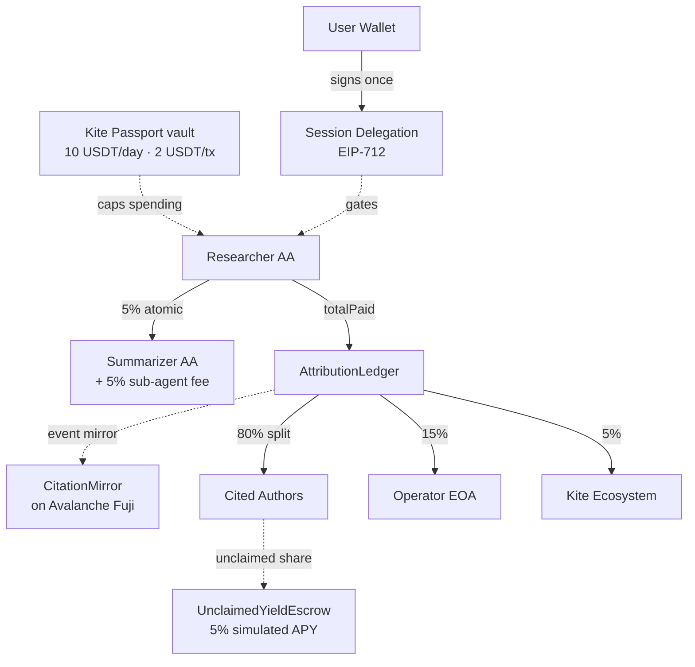

# Architecture

How the pieces fit. The system is intentionally split across four
boundaries: identity, payment, attestation, and mirror.

---

## The actors

```
┌───────────────────┐     ┌──────────────────────┐     ┌──────────────────────┐
│  User Wallet      │     │  Researcher AA       │     │  Summarizer AA       │
│  (EOA)            │     │  (EIP-4337 smart     │     │  (EIP-4337 smart     │
│                   │     │   account)           │     │   account)           │
│  Signs once,      │────▶│  0x4da7f4cF…1776     │────▶│  0xA6C36bA2…ef5c     │
│  delegates a      │ EIP │  Pays authors,       │ 5%  │  Receives sub-agent  │
│  budget envelope. │ 712 │  attests on chain.   │ atm │  fee per query.      │
└───────────────────┘     └──────────────────────┘     └──────────────────────┘
                                     │
                                     ▼
                          ┌──────────────────────┐
                          │  AttributionLedger   │
                          │  (smart contract)    │
                          │                      │
                          │  80% authors         │
                          │  15% operator        │
                          │  5% ecosystem        │
                          └──────────────────────┘
```

| Actor | Type | Role |
|---|---|---|
| User wallet | EOA | Signs the spending intent once via EIP-712. Never pays gas. |
| Researcher AA | EIP-4337 smart account | The "agent." Receives x402 payments, calls `attestAndSplit`, pays authors. |
| Summarizer AA | EIP-4337 smart account | Sub-agent that does the LLM reading. Gets a 5% cut per query. |
| Operator EOA | EOA | Deployer + relayer + Safe signer. Holds the private key that signs UserOps. |
| Operator Safe | 2-of-3 multisig | Governs ecosystem fund withdrawals + contract upgrades. |

The agent identities are AAs deliberately — judges can audit each tx
on KiteScan without grepping a key custodian's database.

---

## Money flow



For each query:

1. **User** signs a SpendingIntent (EIP-712) capping spend per query +
   per day. Server keeps the floor; client value can only ratchet up.
2. **Researcher AA** discovers real papers (OpenAlex / Semantic Scholar),
   then settles corpus access through a genuine x402 handshake — an
   HTTP 402 challenge paid with an on-chain USDT transfer on Kite,
   verified on-chain (facilitator-free, via `/api/x402`).
3. Reads the papers with an OpenRouter LLM and ranks per-paper
   citation weights.
4. Researcher calls `attestAndSplit(queryId, totalPaid, citations[])`.
   Contract pays authors (80% split per weights), operator (15%),
   ecosystem (5%). Authors whose ORCID isn't yet bound have their
   cut deposited to `UnclaimedYieldEscrow` instead — accruing yield
   at 5% APY until they claim via ORCID OAuth.
5. **Off-chain relayer** mirrors the `QueryAttested` event to
   `CitationMirror` on Avalanche Fuji. Cross-chain proof for
   Avalanche-native indexers.

The whole flow is atomic at the EVM level. Either everything settles
or the agent refunds (CLAUDE.md: "Fail closed: if attestation tx
fails, DO NOT send summary to user").

---

## Identity binding

Citation revenue routes to *wallet* but is logically owned by an
*ORCID*. Binding ORCID → wallet is the most security-sensitive flow:

1. Author visits `/dashboard/claim`, types their ORCID.
2. ORCID OAuth round-trip proves they own the ORCID (real path).
   Optional `Skip OAuth (demo)` path is restricted to test ORCIDs
   only — see [Security model](security.md#c1-demo-verify).
3. Author signs an EIP-191 message binding `ORCID → wallet` with
   `chainId: 2368` and `validUntil: <unix>` (10-min window).
4. Server verifies signature + checks no existing on-chain binding
   conflicts (409 if one does).
5. Operator AA relays the binding to `NameRegistry.bind()` on-chain.
6. From the next query onwards, `flattenCitationsForContract` resolves
   the ORCID hash to the bound wallet via `NameRegistry.walletOf()`.

Once bound, future citations route to the wallet. Previously-escrowed
shares can be claimed via `UnclaimedYieldEscrow.claim()` — which
*itself* checks `NameRegistry.walletOf == claimer` so even an operator
key compromise cannot drain escrow to an arbitrary address.

---

## Contracts

All on **Kite testnet (chain 2368)** unless noted:

| Contract | Purpose | Address |
|---|---|---|
| AttributionLedger | Revenue split + attestation ledger | `0xbC4eeC2f…A338` |
| UnclaimedYieldEscrow | Holds unclaimed author shares + APY | `0xcbab887d…547b40` |
| NameRegistry | ORCID hash → wallet binding | `0x5a9b1304…2FEF9` |
| BountyMarket | Topic-keyed research bounties | `0x1ba00a38…b3f72` |
| AgentReputation (ERC-721) | NFT-based per-agent reputation | `0x8f53EB5C…db15` |
| AgentRegistry8004 | ERC-8004 agent discovery | `0xde6d6ab9…7dcd` |
| Operator Safe | 2-of-3 multisig | `0x5258161f…c36AA` |
| SimpleYieldVault | Lucid-DeFi-shaped vault stub | `0xd79bdf14…57fe8` |
| KitePass vault | Spending rule enforcement | `0xe2c4e977…ebc4c` |

On **Avalanche Fuji (chain 43113)**:

| Contract | Purpose | Address |
|---|---|---|
| CitationMirror | Cross-chain receipt mirror | `0x99359dAf…E5fA` |

Same address on both chains is a CREATE2-deterministic coincidence
from the deployer EOA + nonce — not a precompile, just clean ordering.

---

## What's deliberately not on-chain

- **Paper catalog** (`web/data/papers.json`) — 32 real papers from
  OpenAlex. Off-chain because demo data; production would use a
  real research-discovery service.
- **In-flight session state** — agents stream events via Server-Sent
  Events. Session caps are enforced server-side per-signature, not
  on-chain (a Kite Passport upgrade would push this on-chain).
- **Yield generator** — `UnclaimedYieldEscrow` simulates APY in-contract
  via `apyBps * elapsed`. Production swaps the math for a Lucid vault
  view — one-line change documented in the contract NatSpec.

---

## Further reading

- [Agent Passport (deeper dive)](agent-passport.md)
- [Gasless flow (paymaster + AA)](gasless-alignment.md)
- [Testing (how invariants are enforced)](testing.md)
- [Security model (the threat model)](security.md)
