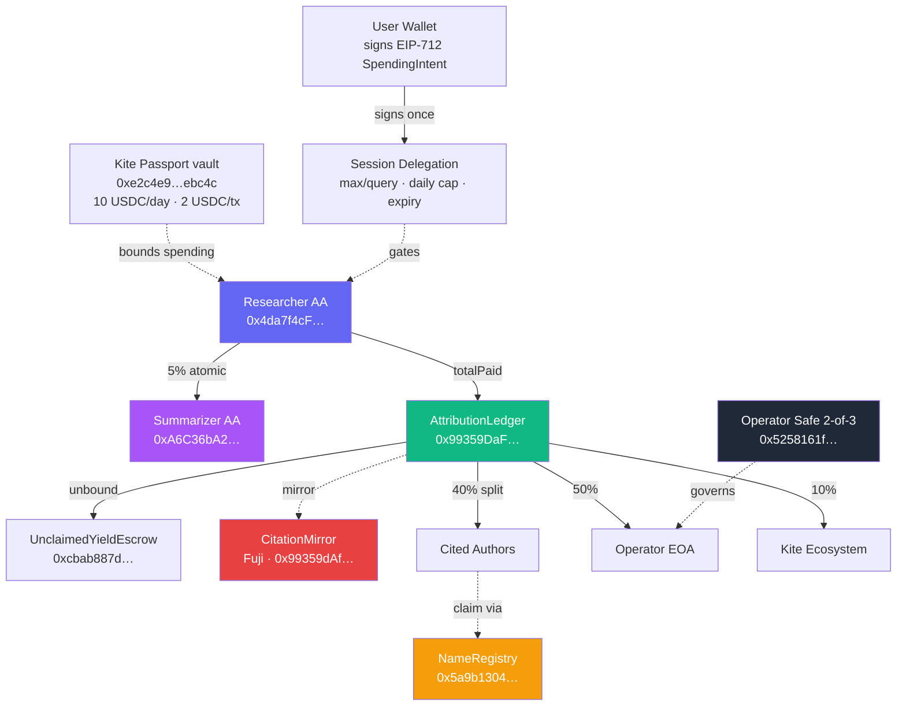

# Kutip — Submission Copy

> **Status:** finalized after the 2026-05-03 KitePass swap — Kite Passport now LIVE & INTEGRATED on chain.
> **Deadline:** Sunday **2026-05-17** (Encode email 2026-04-28 · Rebecca).
> **Live:** https://kutip-zeta.vercel.app · **Repo:** https://github.com/PugarHuda/kutip
> **KitePass vault:** [`0xe2c4e97738884fd6db2fbb62c1cd672ef1debc4c`](https://testnet.kitescan.ai/address/0xe2c4e97738884fd6db2fbb62c1cd672ef1debc4c) · 10 USDC daily · 2 USDC per-tx

---

## 200-word pitch (updated · hackathon track · post-KitePass)

> Kutip is the first agent shipping real Kite Passport delegation
> end-to-end: an autonomous research agent that pays the humans it
> learns from — cryptographically, in one transaction, at the moment
> it answers.
>
> A Researcher smart account (EIP-4337, `0x4da7f4cF…`) operates within
> a Kite Passport vault (`0xe2c4e9…ebc4c`) deployed live on Kite
> testnet — 10 USDC daily, 2 USDC per-tx, on-chain enforcement, auditable
> by anyone. Every query pays a Summarizer sub-agent 5%, settles the
> rest through AttributionLedger (50% operator / 40% cited authors /
> 10% Kite ecosystem), then replicates the receipt to Avalanche Fuji
> within seconds. Gas sponsored by Kite's paymaster in Test USD — user
> pays zero gas in any currency.
>
> Authors prove ownership via real ORCID OAuth (we redirect them to
> orcid.org — they log in, we never guess), then bind their wallet
> on-chain in a NameRegistry contract so future payouts route permanently.
> Ecosystem governance runs through a 2-of-3 Safe multisig.
>
> Twelve contracts across two chains, a full Goldsky subgraph, 53
> automated QA checks. This is what the agentic economy was supposed to
> look like.

---

## 100-word tech summary (for form "what did you build" field)

Kutip ships an end-to-end agentic payment stack on Kite testnet:
Researcher smart-account spends bounded by a live Kite Passport vault
(0xe2c4e9…, 10 USDC/day, 2 USDC/tx, on-chain enforcement). Each query
pays a Summarizer sub-agent 5%, settles USDC through AttributionLedger
(50/40/10 split), replicates receipt to Avalanche Fuji via
CitationMirror. Authors prove ORCID via real OAuth2 → binding on-chain
in NameRegistry. Governance via 2-of-3 Safe multisig. Goldsky subgraph
powers leaderboards + author profiles. Fully gasless — Kite paymaster
covers every transaction in Test USD. Twelve contracts, two chains, 53
automated QA checks.

---

## Demo video outline (90 seconds · keyed to production)

> **Pre-flight checklist:**
> - Fund Researcher AA ≥2 Test USD for demo queries
> - Fire 1 warm-up query (cold start ~30s, warm ~10s)
> - Have ORCID account logged in for the claim scene
> - Pre-open tabs: landing · research · claim · gasless · governance · KiteScan · SnowTrace

### Shot 1 · 0:00–0:10 · Hook
**Visual:** Screen-record KiteScan on an attestation tx showing the
ERC-20 Transfer events (sub-agent fee + ledger transfer + distribution).

**Voice:**
> "Every citation this AI agent makes triggers a USDC payment to the
> real authors. On-chain. In one atomic transaction. Let me show you."

### Shot 2 · 0:10–0:20 · Landing
**Visual:** https://kutip-zeta.vercel.app. Focus on the agent identity
block — Researcher AA, Summarizer AA, AttributionLedger, Pieverse chip.

**Voice:**
> "Kutip. Three agents, one ledger, all live on Kite testnet. The
> agent's smart account is what pays authors — not the user's wallet."

### Shot 3 · 0:20–0:35 · Passport delegation (NEW)
**Visual:** `/research`. Connect wallet via topnav. Sidebar shows
"Agent Passport — delegate a budget". Fill 2/10/24. MetaMask EIP-712
popup with structured data. Sign → "Passport · active" badge.

**Voice:**
> "Before the agent runs, I sign one Passport delegation: max 2 USDC
> per query, 10 per day, 24-hour expiry. This is Kite's session-key
> pattern — agent runs autonomously within these caps, no per-query
> prompts. I can revoke anytime."

### Shot 4 · 0:35–0:55 · Full agent flow
**Visual:** Type a question, click Pay. Watch per-step themed icons +
rotating ticker ("Searching Semantic Scholar → Ranking relevance →
Filtering catalog"). Live progress bar. 5 steps settle.

**Voice (as each lands):**
> "Search real papers. Pay each via x402. Read them with an LLM.
> Attribute citations with weights. Settle atomically on Kite —
> sub-agent fee, ledger transfer, and attestAndSplit in ONE UserOp
> sponsored by the paymaster."

### Shot 5 · 0:55–1:15 · The climax (receipt + KitePass + mirror)
**Visual:** Result receipt animates in. Scroll: summary with cite pills,
authors paid table, "Authorized under session" row with Passport ✓,
**"Spending bounded by Kite Passport vault" row with `Kite Passport ✓`
chip — click vault address, KiteScan opens showing the vault's spending
rules with `amountUsed` ticking up live**. Then "Mirrored on Avalanche
Fuji" with LayerZero-pattern chip. Click Kite tx → KiteScan. Click
Fuji tx → SnowTrace.

**Voice:**
> "The receipt. Every author, their cut, their wallet, the hash. The
> agent's spending was on-chain-bounded by our Kite Passport vault —
> deployed live, ten USDC per day, two per transaction. Click — see
> the rules and usage right on KiteScan. And within seconds, this
> attestation mirrors to Avalanche Fuji. Cross-chain citation proof,
> zero user gas."

### Shot 6 · 1:15–1:30 · ORCID ownership + governance
**Visual:** Cut to `/claim`. Type an ORCID, click "Verify via ORCID" —
redirect to orcid.org login, come back with green "Signed in as" badge.
Then flash to `/governance` — "2 / 3 signers required" big number.

**Voice:**
> "Authors prove they own the ORCID via real OAuth, not just knowing
> the number. The binding gets written on-chain. And the ecosystem
> fund is gated by a 2-of-3 Safe multisig. Even we can't move the
> money alone."

### Shot 7 · 1:30–1:40 · CTA
**Visual:** End card, logo + URL.

**Voice:**
> "Kutip. The research agent that pays its sources. Kite AI hackathon,
> Novel track. Live link in description."

---

## Updated architecture diagram (mermaid)

---

## Performance metrics (2026-04-21 production)

Sequential stress test · 5 research queries · 0.1 USDC budget:

| Metric | Value |
|---|---|
| **Success rate** | 4 / 5 (80%) — 1 fail was balance exhaustion |
| **p50 latency** | 12.5 s |
| **p95 latency** | 38.4 s (dominated by Lambda cold start) |
| **Warm p50** | ~10 s |
| **QA suite** | 50 / 50 automated checks passing |

---

## Launch tweet (280 chars)

> built an AI research agent that pays the authors it cites — in usdc,
> on-chain, cross-chain, in one userop sponsored in stablecoin.
>
> passport-style session delegation. real orcid oauth + on-chain binding.
> 2-of-3 safe governance.
>
> live on kite testnet 👇
> https://kutip-zeta.vercel.app
>
> @GoKiteAI · novel track

---

## LinkedIn post (200 words)

> The AI era broke the content economy. Scrapers take everything,
> creators get nothing. I built what a fix could look like.
>
> **Kutip** is an autonomous research agent on Kite AI that actually
> pays the humans it cites. Ask it a research question — it finds
> papers, reads them with an LLM, and at the end it settles USDC
> transfers to every cited author's wallet, on-chain, atomically.
>
> Technically interesting bits:
> - **EIP-4337 smart account** runs the agent — Kite's paymaster
>   covers gas in USDC, no native KITE ever touched.
> - **Session delegation** (Kite-Agent-Passport-compatible): user
>   signs one EIP-712 to set caps, agent operates without prompts.
> - **Real ORCID OAuth** for authors to prove they own the ORCID,
>   then bind their wallet on-chain via NameRegistry contract.
> - **Cross-chain mirror** on Avalanche Fuji for every receipt.
> - **2-of-3 Safe multisig** governs the ecosystem fund.
>
> Eleven contracts across two chains, a Goldsky subgraph, and 50
> automated QA checks. Built for the 2026 Kite AI hackathon, Novel
> track.
>
> Live: https://kutip-zeta.vercel.app
> Repo: https://github.com/PugarHuda/kutip

---

## Discord `#general` post (≤400 chars)

> gm kite builders 🪁
>
> submitting Kutip to the Novel track: research agent that pays cited
> authors atomically on-chain. passport-style session delegation, real
> orcid oauth → on-chain binding, cross-chain mirror to avalanche fuji,
> 2-of-3 safe governance, 50 automated qa checks.
>
> live: https://kutip-zeta.vercel.app
> repo: https://github.com/PugarHuda/kutip
>
> would love feedback before i record the final video

---

## Judging criteria alignment

| Criterion | Evidence |
|---|---|
| **Agent Autonomy** | Passport session delegation → agent runs without per-query human clicks within cryptographic caps. AA-native attestations. Daily cap + per-query cap enforced server-side, revocable by user anytime. |
| **Developer Experience** | `/gasless` live showcase page. Error decoder that surfaces custom errors (`WeightMismatch`, `ERC20InsufficientAllowance`, etc.). 50-check QA suite in one `node scripts/qa-test.mjs`. README with contract table + architecture diagram + quickstart. |
| **Real-World Applicability** | Solves the real AI-scraping crisis. ORCID OAuth is production-grade (not mocked). On-chain `NameRegistry` = permanent audit trail. Escrow holds unclaimed payouts. |
| **Novel / Creativity** | Reverse x402 (cache paywall). Citation bounties. Cross-chain receipt mirror. Two-agent composition with atomic sub-agent fees. ERC-8004 + ERC-6551 stacked. Agent Passport pattern before Kite's public launch. |

---

## Submission form field map (Encode Club)

| Field | Value |
|---|---|
| Project name | `Kutip` |
| Tagline | `The research agent that pays its sources.` |
| Live URL | `https://kutip-zeta.vercel.app` |
| Repo URL | `https://github.com/PugarHuda/kutip` |
| Video URL | *(upload to YouTube unlisted after recording)* |
| Short description | ← 100-word tech summary above |
| Long description | ← 200-word pitch above |
| Track | Novel |
| Built on | Kite AI · Avalanche · OpenRouter · Foundry · Vercel · Semantic Scholar · ORCID · Goldsky · Pieverse · Safe |
| Team | Pugar Huda Mantoro (solo · @PugarHuda) |
| Email | pugarhudam@gmail.com |

---

## Contract addresses (submission form / docs)

### Kite testnet (chain 2368)
- AttributionLedger: `0x99359DaF4f2504dF3da042cd38B8d01B8589E5Fa`
- UnclaimedYieldEscrow: `0xcbab887da9c2a16612a9120b4170e74c50547b40`
- BountyMarket: `0x1ba00a38b25adf68ac599cd25094e2aa923b3f72`
- AgentReputation (ERC-721): `0x8f53EB5C04B773F0F31FE41623EA19d2Fd84db15`
- AgentRegistry8004: `0xde6d6ab98f216e6421c1b73bdab2f03064d27dcd`
- ERC6551 Registry: `0x2f432effbbd83df8df610e5e0c0057b65bd31012`
- ERC6551 Account impl: `0x7d9c63f12af5ad7a18bb8d39ac8c1dd23e95f456`
- NameRegistry: `0x5a9b13043452a99A15cA01F306191a639002FEF9`
- Operator Safe (2-of-3): `0x5258161fb69e6a33922c1Fe46C042A78572c36AA`

### Avalanche Fuji (chain 43113)
- CitationMirror: `0x99359dAf4f2504dF3DA042cD38b8D01b8589E5fA`

### Agent identities (Kite)
- Researcher AA: `0x4da7f4cFd443084027a39cc0f7c41466d9511776`
- Summarizer AA: `0xA6C36bA2BC8E84fCF276721F30FC79ceD609ef5c`

---

## Screenshot shot list (for README + social)

Collect in `/docs/screenshots/`:

1. `landing-hero.png` — 1280×900 above-fold
2. `research-flow.png` — 5-step progress with themed icons mid-query
3. `research-receipt.png` — receipt with Passport ✓ + LayerZero-pattern chips
4. `claim-oauth-verified.png` — /claim with "Signed in as ORCID" banner
5. `author-detail.png` — /authors/[id] with sparkline + papers list
6. `gasless-showcase.png` — /gasless hero "0" + wallet cards
7. `governance-safe.png` — /governance "2 / 3 signers" + 3 owners
8. `kitescan-attest-tx.png` — KiteScan showing atomic batch UserOp
9. `snowtrace-mirror-tx.png` — Fuji tx with AttestationMirrored event

---

## Timeline (post-extension)

- [x] D1-D9: Core stack ship (agent + contracts + UI)
- [x] D10 (2026-04-20): Passport session, ORCID OAuth, Fuji mirror, on-chain NameRegistry, Safe 2-of-3, gasless page, governance page, author detail page
- [x] D11 (2026-04-21): README overhaul + stress test + submission polish
- [ ] Record demo video (end of week)
- [ ] Collect all screenshots
- [ ] Final QA before submit
- [ ] Submit to Encode Club form (before final deadline TBC)
- [ ] Tweet + LinkedIn + Discord post
