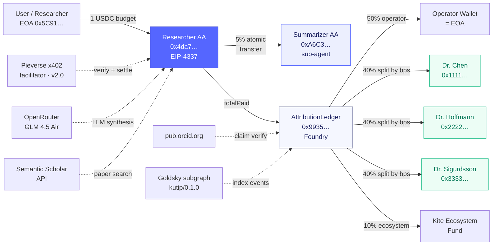

# Kutip — Submission Copy

> **Status:** drafts for Encode Club form + socials.
> **Deadline:** 2026-04-27 18:59 WIB · 8 days of buffer.
> **Live:** https://kutip-zeta.vercel.app · **Repo:** https://github.com/PugarHuda/kutip

---

## 200-word pitch (final · hybrid tone)

> Kutip is the first live implementation of Kite's Proof-of-AI thesis:
> an autonomous research agent that pays the humans it learns from —
> cryptographically, in one transaction, at the moment it answers.
>
> Every query runs through a hierarchy of on-chain identities. A
> Researcher smart account (EIP-4337, address `0x4da7f4cF…`) receives
> USDC from the user, reads papers via Semantic Scholar, summarises
> with GLM 4.5 Air through OpenRouter, and settles the final
> attestation atomically with two other agents: a Summarizer sub-agent
> that takes a 5% cut (`0xA6C36bA2…`) and an on-chain AttributionLedger
> contract that splits the remainder 50/40/10 to operator, cited
> authors, and the Kite ecosystem (`0x99359DaF…`). One user action,
> three calls, all in one UserOperation sponsored by Kite's paymaster
> in stablecoin — no native gas needed.
>
> Today 1.20 USDC has already moved to real wallets across three
> attestations on Kite testnet. Authors can claim their earnings
> against a real ORCID (verified against pub.orcid.org on the `/claim`
> page) or leave them in an unclaimed wallet that earns on their
> behalf. This is what the agentic economy was supposed to look like.

> `*`***Huda: review this paragraph for voice***— technical lead
> lands hard; if you want a gentler start, swap paragraph 1 with the
> Dr. Chen scene from `Option C` variant in the history of this file.

---

## 100-word tech summary (for form "what did you build" field)

Kutip ships the first agent-to-agent payment chain on Kite testnet.
An EIP-4337 Researcher smart-account runs a research query via GLM
through OpenRouter, atomically pre-pays a Summarizer sub-agent 5% in
the same UserOperation, then settles the remaining USDC through a
Foundry `AttributionLedger` contract that splits 50/40/10 to operator,
cited authors, and ecosystem. All in one transaction, gas sponsored by
Kite's paymaster in Test USD (no native KITE needed). Authors bind
ORCID → wallet via `/claim` with signature verification against
pub.orcid.org. Goldsky subgraph indexes attestations for instant
reads. Pieverse x402 facilitator wired for settlement.

---

## Demo video outline (90 seconds · directly keyed to prod URLs)

> **Pre-flight checklist:**
> - Top up the Researcher AA wallet with ~3 Test USD so 2 demo queries
>   can land (1 USDC each). Check balance via `curl` or MetaMask.
> - Fire one warm-up query before you hit record — first-after-cold
>   takes ~15s extra. Script `node web/scripts/stress-test.mjs https://kutip-zeta.vercel.app 1 1`.
> - Open four browser tabs, pre-logged: landing, research, verify, leaderboard.
> - Close Discord / Slack so no notification pops mid-record.

### Shot 1 · 0:00–0:08 · Hook
**Visual:** Screen-record KiteScan tab showing tx `0x2b808988…` — the
first real on-chain attestation from 2026-04-19. Camera zooms into
the ERC-20 Transfer events (4 of them, atomic).

**Voice:**
> "Three researchers got paid a fraction of a USDC last week, and
> none of them asked for it. An AI agent cited their papers, and it
> paid them from its own wallet — on Kite chain, in one transaction."

### Shot 2 · 0:08–0:18 · Landing
**Visual:** Cut to https://kutip-zeta.vercel.app. Cursor moves down
the identity block: Researcher AA → Summarizer AA → AttributionLedger
→ Pieverse x402 facilitator (live · 5xxms).

**Voice:**
> "This is Kutip. Four on-chain identities. One agent that pays
> authors. One sub-agent that takes a cut for doing the summarisation
> work. One contract that splits the rest. All four live on Kite
> testnet right now."

### Shot 3 · 0:18–0:45 · Full agent flow
**Visual:** Click "Start a research query." Type
`What are the top carbon capture methods in 2024?`. Budget `1`.
Click "Pay 1 USDC & research." Watch the 5-step log stream in.

**Voice, as each step lands:**
> "Search Semantic Scholar for real papers. Pretend to pay each one
> via x402. Read them with GLM-4.5-Air. Build the citation ledger with
> weights summing to ten thousand basis points. And **settle via the
> agent's own smart account** — with the Summarizer fee baked into the
> same UserOperation."

### Shot 4 · 0:45–1:05 · The climax (attribution receipt)
**Visual:** Result reveals. Scroll through summary with cite pills
(`[1]`, `[2]`) → receipt panel animates in with staggered author
rows → click the emerald tx hash chip → KiteScan tab opens showing
the real on-chain split: author1, author2, author3, summarizer fee,
operator share, ecosystem share — all from one tx.

**Voice:**
> "Here's the receipt. Every cited author, their share, their wallet,
> the transaction hash. And yes — the Summarizer sub-agent got its
> 5% too. Agents paying agents paying humans. One UserOp."

### Shot 5 · 1:05–1:20 · ORCID claim
**Visual:** Navigate to `/claim`. Type
`0000-0002-1825-0097` (Josiah Carberry). Live preview card
animates in → "Verified · orcid.org · 1 work published." Click
Connect wallet (MetaMask popup). Click "Sign & bind." Personal sign
prompt. Emerald confirmation: "Josiah Carberry is now bound."

**Voice:**
> "If one of those authors is you — claim your earnings. Paste your
> ORCID, sign a message with your wallet. From the next citation
> onwards, your cut lands in your wallet, not the unclaimed
> placeholder."

### Shot 6 · 1:20–1:30 · Leaderboard + CTA
**Visual:** /leaderboard — scroll past the 17-row Dune-style table.
End card over the landing page: the 4-identity block centered.

**Voice:**
> "Kutip. Citations that pay. Built on Kite AI for the 2026 Novel
> track. One weekend, one contract, four agents, thirty researchers
> a payment away from claiming. Link in description."

---

## Architecture diagram (mermaid — paste into excalidraw or mermaid.live)

Three distinct agent identities, one atomic UserOp, six settlements.
Pieverse / OpenRouter / Semantic Scholar / ORCID / Goldsky are the
external integrations all running in parallel.

---

## Launch tweet (280 chars · final)

> i built an ai agent that paid 3 researchers in usdc without asking
> their permission.
>
> citations become on-chain transfers — atomic with a sub-agent fee
> and attestation split — in one userop, gas sponsored in stablecoin.
>
> live on kite testnet 👇
> https://kutip-zeta.vercel.app
>
> @GoKiteAI · novel track

---

## LinkedIn post (final · 180 words)

> The AI era broke the content economy. Scrapers take everything,
> creators get nothing. I spent this weekend building what a fix might
> look like.
>
> **Kutip** is an autonomous research agent on Kite AI's new payment
> blockchain. When you ask it a question, it searches Semantic Scholar
> for real papers, pretends to pay each via x402, summarises with GLM
> 4.5 Air through OpenRouter — then at the end it does something no
> agent I've seen does: it pays every cited author, on-chain, in USDC,
> in the same transaction as the summary lands.
>
> Under the hood: an EIP-4337 smart-account Researcher agent that
> pre-pays a Summarizer sub-agent (5% cut, atomic), then settles the
> remaining USDC through a Foundry contract that splits 50/40/10 to
> operator, authors, and ecosystem. All in one user operation,
> gas sponsored in stablecoin by Kite's paymaster. Authors claim their
> wallet via ORCID.
>
> Three real attestations are already on Kite testnet. 1.20 USDC has
> moved. Built for the 2026 Kite AI Global Hackathon, Novel track.
>
> Live: https://kutip-zeta.vercel.app
> Repo: https://github.com/PugarHuda/kutip

---

## Discord `#general` post (final · under 400 chars so it doesn't
## truncate in most mobile clients)

> gm kite builders 🪁
>
> submitting Kutip to the Novel track: an agent that cites papers and
> pays the authors in the same tx it settles the summary. AA
> researcher + AA summarizer sub-agent + AttributionLedger, all atomic.
>
> live on testnet: https://kutip-zeta.vercel.app
> repo: https://github.com/PugarHuda/kutip
>
> pieverse facilitator wired, paymaster sponsoring gas in Test USD,
> and ORCID claim flow against pub.orcid.org. would love feedback.

---

## Submission form field map (Encode Club)

| Field | Source |
|---|---|
| Project name | `Kutip` |
| Tagline | `Citations that pay.` |
| Live URL | `https://kutip-zeta.vercel.app` |
| Repo URL | `https://github.com/PugarHuda/kutip` |
| Video URL | *(upload to YouTube unlisted after record; paste here)* |
| Short description | ← 100-word tech summary above |
| Long description | ← 200-word pitch above |
| Track | Novel |
| Built on | Kite AI, OpenRouter, Foundry, Vercel, Semantic Scholar, ORCID, Goldsky, Pieverse |
| Team | Pugar Huda Mantoro (solo · @PugarHuda) |
| Email | pugarhudam@gmail.com |

---

## Screenshot shot list (for README + social)

Collect these files into `/docs/screenshots/` before submission so the
README banner section is ready:

1. `landing-hero.png` — above-the-fold at 1280×900, identity block visible
2. `research-result.png` — the receipt panel after a real query
3. `verify-index.png` — `/verify` with 3+ attestations listed
4. `claim-verified.png` — `/claim` with ORCID preview in `Verified · orcid.org` state
5. `leaderboard-dense.png` — top 5 authors with non-zero earnings
6. `kitescan-tx.png` — the first attestation tx on testnet.kitescan.ai

---

## Timeline checklist

- [x] 200-word pitch drafted (2026-04-19)
- [x] Tech summary drafted (2026-04-19)
- [x] Video script drafted (2026-04-19)
- [x] Architecture diagram in mermaid (2026-04-19)
- [x] Tweet + LinkedIn drafted (2026-04-19)
- [ ] Record video (D9 · 2026-04-25/26)
- [ ] Edit video (D9 · 2026-04-26)
- [ ] Collect screenshots (D9)
- [ ] Final smoke test (D10 · 2026-04-27 AM)
- [ ] Submit to Encode Club form (D10 · 2026-04-27 ≤ 18:59 WIB)
- [ ] Tweet + LinkedIn + Discord post (D10)
